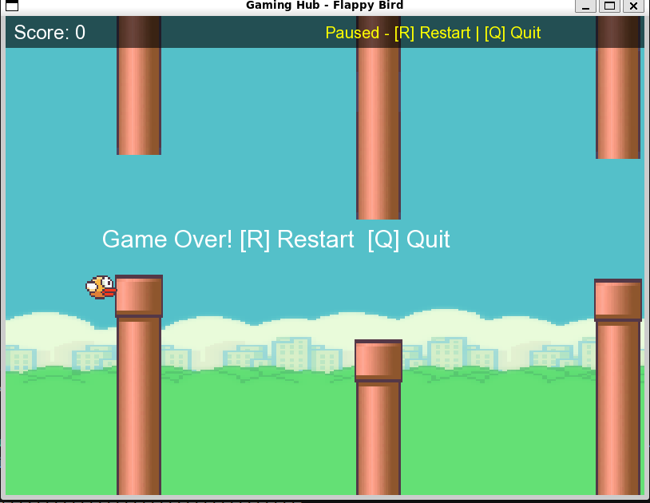

# Flappy Bird (SFML, C++)

## Overview
This project is a desktop Flappy Bird game built in C++ using SFML.
The game includes smooth bird physics, moving pipe obstacles, live score tracking, and a persistent leaderboard.

## Game Preview


A key gameplay behavior is now included:
- On collision with a pipe (or boundary), gameplay stops immediately.
- The window stays open and shows options to restart or quit.
- You can restart instantly without running the command again.

## Features
- Real-time Flappy Bird gameplay using SFML rendering.
- Bird movement with gravity and jump controls.
- Randomized pipe gaps for varied difficulty.
- Live score display during gameplay.
- Supports player names with spaces.
- Pause support during play.
- Game-over state with in-window actions:
  - `R` to restart instantly.
  - `Q` (or `Esc`) to quit.
- Session-best score tracking across restarts before quit.
- Leaderboard persistence in `scores.txt`.

## Controls
- `W` or `Space`: Jump
- `P`: Pause/Resume
- `R`: Restart (on game-over screen)
- `Q` or `Esc`: Quit (on game-over screen)

## Project Structure
```text
flappybird-cpp/
├── assets/
│   ├── bg.png
│   ├── bird.png
│   ├── pipe.png
│   └── font.ttf
├── core/
│   ├── main.cpp
│   ├── flappybird.cpp
│   ├── flappybird.h
│   ├── LeaderboardManager.cpp
│   └── LeaderboardManager.h
├── makefile
├── libraries.sh
├── scores.txt
└── read.md
```

## Build and Run
### 1) Install dependencies (Linux)
Use your package manager to install SFML development libraries.

Example (Ubuntu/Debian):
```bash
sudo apt update
sudo apt install -y g++ make libsfml-dev
```

### 2) Build
From the project root:
```bash
make
```

### 3) Run
```bash
./gaming_hub
```

## Clean Build Files
```bash
make clean
```

## Notes
- Enter a player name in terminal before gameplay starts.
- Score saved on exit is the best score achieved in that session (including restarts).
- Scores are saved in `scores.txt` and shown after exit.
- Keep the `assets` folder in place, otherwise textures/font will fail to load.

## GitHub Push Checklist
```bash
git add .
git commit -m "Add restart-on-game-over flow and project read.md"
git push origin <your-branch>
```
